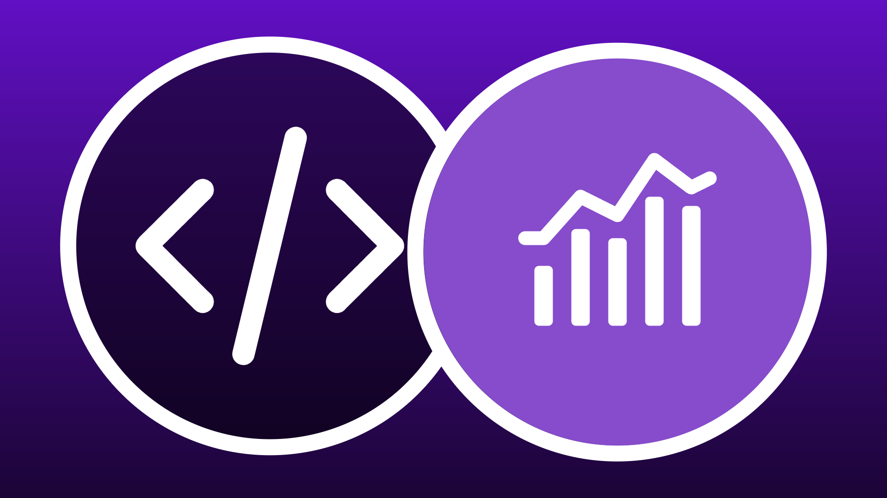

# 빌더용 API

<!-- last-modified: 2026-06-02 -->


Adobe CX Enterprise API를 사용하면 개발자와 AI 지원 코딩 에이전트 툴이 Adobe 데이터 및 워크플로우에 직접 액세스할 수 있습니다. 이를 사용하여 사용자 정의 애플리케이션을 구축하고, 통합을 자동화하고, Adobe 기능을 자체 시스템에 임베드할 수 있습니다. API는 시스템 통합에 대한 완전한 프로그래밍 방식 제어가 필요하거나 Adobe 데이터 위에 애플리케이션을 구축하는 경우 올바른 선택입니다. Adobe 워크플로에 대한 에이전트 기반 대화 액세스는 [MCP 서버](mcp-servers.md)를 참조하십시오.

## Adobe CX 엔터프라이즈 API

Adobe CX Enterprise API는 Adobe Experience Platform, Journey Optimizer 및 Customer Journey Analytics과 같은 제품을 지원하는 핵심 데이터 및 작업을 제공합니다. 각 API는 API 우선 설계를 따르며, 개발자와 AI 지원 코딩 에이전트 툴이 Adobe에서 내부적으로 사용하는 동일한 기능에 직접 프로그래밍 방식으로 액세스할 수 있도록 합니다. 이를 사용하여 맞춤형 애플리케이션을 구축하고, 워크플로우를 자동화하고, Adobe 데이터를 자체 시스템에 통합합니다.

<!--
CARDS

* https://developer.adobe.com/audience-manager/
  {title = Audience Manager}
  {description = Audience management and activation workflows.}
  {cta = Explore API}
  {target = _blank}
  {image = ../assets/apis-aam-card.png}

* https://developer.adobe.com/client-sdks/home/
  {title = Client SDKs}
  {description = Mobile SDKs, edge SDKs, and in-app messaging.}
  {cta = Explore API}
  {target = _blank}
  {image = ../assets/apis-cxenterprise-card.png}

* https://developer.adobe.com/cja-apis/docs/
  {title = Customer Journey Analytics}
  {description = Analytics data access, reporting, and CJA insights workflows.}
  {cta = Explore API}
  {target = _blank}
  {image = ../assets/apis-cja-card.png}

* https://developer.adobe.com/data-collection-apis/docs/
  {title = Data Collection}
  {description = Edge Network data ingestion, real-time event collection, and streaming data delivery.}
  {cta = Explore API}
  {target = _blank}
  {image = ../assets/apis-aep-card.png}

* https://developer.adobe.com/developer-console/docs/guides/
  {title = Developer Console}
  {description = API project setup, authentication, and credential management.}
  {cta = Explore API}
  {target = _blank}
  {image = ../assets/apis-cxenterprise-card.png}

* https://developer.adobe.com/events/docs/
  {title = Events}
  {description = Event-driven integrations, webhooks, and automation triggers.}
  {cta = Explore API}
  {target = _blank}
  {image = ../assets/apis-cxenterprise-card.png}

* https://experienceleague.adobe.com/ko/docs/experience-platform/privacy/home
  {title = Privacy}
  {description = Privacy workflows, data governance, and data subject requests.}
  {cta = Explore API}
  {target = _blank}
  {image = ../assets/apis-aep-card.png}

* https://developer.adobe.com/experience-platform-apis/
  {title = Adobe Experience Platform}
  {description = CRUD operations for datasets, schemas, profiles, identities, queries, and segmentation.}
  {cta = Explore API}
  {target = _blank}
  {image = ../assets/apis-aep-card.png}

* https://developer.adobe.com/journey-optimizer-apis/
  {title = Adobe Journey Optimizer}
  {description = Journey orchestration, campaign management, content templates, and offer decisioning.}
  {cta = Explore API}
  {target = _blank}
  {image = ../assets/apis-ajo-card.png}

* https://developer.adobe.com/analytics-apis/docs/2.0/
  {title = Adobe Analytics}
  {description = Reporting, data feeds, calculated metrics, and segment management.}
  {cta = Explore API}
  {target = _blank}
  {image = ../assets/apis-analytics-card.png}

* https://experienceleague.adobe.com/en/docs/experience-manager-cloud-service/content/implementing/developing/apis-and-extensions
  {title = AEM as a Cloud Service}
  {description = Content, asset, and workflow management APIs for Adobe Experience Manager.}
  {cta = Explore API}
  {target = _blank}
  {image = ../assets/apis-aem-card.png}

* https://developer.adobe.com/commerce/webapi/
  {title = Adobe Commerce}
  {description = REST and GraphQL APIs for catalog, cart, orders, customers, and promotions.}
  {cta = Explore API}
  {target = _blank}
  {image = ../assets/apis-commerce-card.png}

* https://developer.adobe.com/umapi/
  {title = User Management}
  {description = User management, identity administration, and enterprise account automation.}
  {cta = Explore API}
  {target = _blank}
  {image = ../assets/apis-cxenterprise-card.png}
-->
<!-- START CARDS HTML - DO NOT MODIFY BY HAND -->
<div class="columns">
    <div class="column is-half-tablet is-half-desktop is-one-third-widescreen" aria-label="Audience Manager">
        <div class="card" style="height: 100%; display: flex; flex-direction: column; height: 100%;">
            <div class="card-image">
                <figure class="image x-is-16by9">
                    <a href="https://developer.adobe.com/audience-manager/" title="Audience Manager" target="_blank" rel="referrer">
                        
                    </a>
                </figure>
            </div>
            <div class="card-content is-padded-small" style="display: flex; flex-direction: column; flex-grow: 1; justify-content: space-between;">
                <div class="top-card-content">
                    <p class="headline is-size-6 has-text-weight-bold">
                        <a href="https://developer.adobe.com/audience-manager/" target="_blank" rel="referrer" title="Audience Manager">Audience Manager</a>
                    </p>
                    <p class="is-size-6">대상자 관리 및 활성화 워크플로.</p>
                </div>
                <a href="https://developer.adobe.com/audience-manager/" target="_blank" rel="referrer" class="spectrum-Button spectrum-Button--outline spectrum-Button--primary spectrum-Button--sizeM" style="align-self: flex-start; margin-top: 1rem;">
                    <span class="spectrum-Button-label has-no-wrap has-text-weight-bold">API 탐색</span>
                </a>
            </div>
        </div>
    </div>
    <div class="column is-half-tablet is-half-desktop is-one-third-widescreen" aria-label="Client SDKs">
        <div class="card" style="height: 100%; display: flex; flex-direction: column; height: 100%;">
            <div class="card-image">
                <figure class="image x-is-16by9">
                    <a href="https://developer.adobe.com/client-sdks/home/" title="클라이언트 SDK" target="_blank" rel="referrer">
                        
                    </a>
                </figure>
            </div>
            <div class="card-content is-padded-small" style="display: flex; flex-direction: column; flex-grow: 1; justify-content: space-between;">
                <div class="top-card-content">
                    <p class="headline is-size-6 has-text-weight-bold">
                        <a href="https://developer.adobe.com/client-sdks/home/" target="_blank" rel="referrer" title="클라이언트 SDK">클라이언트 SDK</a>
                    </p>
                    <p class="is-size-6">Mobile SDK, Edge SDK 및 인앱 메시지.</p>
                </div>
                <a href="https://developer.adobe.com/client-sdks/home/" target="_blank" rel="referrer" class="spectrum-Button spectrum-Button--outline spectrum-Button--primary spectrum-Button--sizeM" style="align-self: flex-start; margin-top: 1rem;">
                    <span class="spectrum-Button-label has-no-wrap has-text-weight-bold">API 탐색</span>
                </a>
            </div>
        </div>
    </div>
    <div class="column is-half-tablet is-half-desktop is-one-third-widescreen" aria-label="Customer Journey Analytics">
        <div class="card" style="height: 100%; display: flex; flex-direction: column; height: 100%;">
            <div class="card-image">
                <figure class="image x-is-16by9">
                    <a href="https://developer.adobe.com/cja-apis/docs/" title="Customer Journey Analytics" target="_blank" rel="referrer">
                        
                    </a>
                </figure>
            </div>
            <div class="card-content is-padded-small" style="display: flex; flex-direction: column; flex-grow: 1; justify-content: space-between;">
                <div class="top-card-content">
                    <p class="headline is-size-6 has-text-weight-bold">
                        <a href="https://developer.adobe.com/cja-apis/docs/" target="_blank" rel="referrer" title="Customer Journey Analytics">Customer Journey Analytics</a>
                    </p>
                    <p class="is-size-6">Analytics 데이터 액세스, 보고 및 CJA 통찰력 워크플로우입니다.</p>
                </div>
                <a href="https://developer.adobe.com/cja-apis/docs/" target="_blank" rel="referrer" class="spectrum-Button spectrum-Button--outline spectrum-Button--primary spectrum-Button--sizeM" style="align-self: flex-start; margin-top: 1rem;">
                    <span class="spectrum-Button-label has-no-wrap has-text-weight-bold">API 탐색</span>
                </a>
            </div>
        </div>
    </div>
    <div class="column is-half-tablet is-half-desktop is-one-third-widescreen" aria-label="Data Collection">
        <div class="card" style="height: 100%; display: flex; flex-direction: column; height: 100%;">
            <div class="card-image">
                <figure class="image x-is-16by9">
                    <a href="https://developer.adobe.com/data-collection-apis/docs/" title="데이터 수집" target="_blank" rel="referrer">
                        
                    </a>
                </figure>
            </div>
            <div class="card-content is-padded-small" style="display: flex; flex-direction: column; flex-grow: 1; justify-content: space-between;">
                <div class="top-card-content">
                    <p class="headline is-size-6 has-text-weight-bold">
                        <a href="https://developer.adobe.com/data-collection-apis/docs/" target="_blank" rel="referrer" title="데이터 수집">데이터 수집</a>
                    </p>
                    <p class="is-size-6">Edge Network 데이터 수집, 실시간 이벤트 수집 및 스트리밍 데이터 전달.</p>
                </div>
                <a href="https://developer.adobe.com/data-collection-apis/docs/" target="_blank" rel="referrer" class="spectrum-Button spectrum-Button--outline spectrum-Button--primary spectrum-Button--sizeM" style="align-self: flex-start; margin-top: 1rem;">
                    <span class="spectrum-Button-label has-no-wrap has-text-weight-bold">API 탐색</span>
                </a>
            </div>
        </div>
    </div>
    <div class="column is-half-tablet is-half-desktop is-one-third-widescreen" aria-label="Developer Console">
        <div class="card" style="height: 100%; display: flex; flex-direction: column; height: 100%;">
            <div class="card-image">
                <figure class="image x-is-16by9">
                    <a href="https://developer.adobe.com/developer-console/docs/guides/" title="Developer Console" target="_blank" rel="referrer">
                        
                    </a>
                </figure>
            </div>
            <div class="card-content is-padded-small" style="display: flex; flex-direction: column; flex-grow: 1; justify-content: space-between;">
                <div class="top-card-content">
                    <p class="headline is-size-6 has-text-weight-bold">
                        <a href="https://developer.adobe.com/developer-console/docs/guides/" target="_blank" rel="referrer" title="Developer Console">Developer Console</a>
                    </p>
                    <p class="is-size-6">API 프로젝트 설정, 인증 및 자격 증명 관리.</p>
                </div>
                <a href="https://developer.adobe.com/developer-console/docs/guides/" target="_blank" rel="referrer" class="spectrum-Button spectrum-Button--outline spectrum-Button--primary spectrum-Button--sizeM" style="align-self: flex-start; margin-top: 1rem;">
                    <span class="spectrum-Button-label has-no-wrap has-text-weight-bold">API 탐색</span>
                </a>
            </div>
        </div>
    </div>
    <div class="column is-half-tablet is-half-desktop is-one-third-widescreen" aria-label="Events">
        <div class="card" style="height: 100%; display: flex; flex-direction: column; height: 100%;">
            <div class="card-image">
                <figure class="image x-is-16by9">
                    <a href="https://developer.adobe.com/events/docs/" title="이벤트" target="_blank" rel="referrer">
                        
                    </a>
                </figure>
            </div>
            <div class="card-content is-padded-small" style="display: flex; flex-direction: column; flex-grow: 1; justify-content: space-between;">
                <div class="top-card-content">
                    <p class="headline is-size-6 has-text-weight-bold">
                        <a href="https://developer.adobe.com/events/docs/" target="_blank" rel="referrer" title="이벤트">이벤트</a>
                    </p>
                    <p class="is-size-6">이벤트 기반 통합, 웹후크 및 자동화 트리거.</p>
                </div>
                <a href="https://developer.adobe.com/events/docs/" target="_blank" rel="referrer" class="spectrum-Button spectrum-Button--outline spectrum-Button--primary spectrum-Button--sizeM" style="align-self: flex-start; margin-top: 1rem;">
                    <span class="spectrum-Button-label has-no-wrap has-text-weight-bold">API 탐색</span>
                </a>
            </div>
        </div>
    </div>
    <div class="column is-half-tablet is-half-desktop is-one-third-widescreen" aria-label="Privacy">
        <div class="card" style="height: 100%; display: flex; flex-direction: column; height: 100%;">
            <div class="card-image">
                <figure class="image x-is-16by9">
                    <a href="https://experienceleague.adobe.com/ko/docs/experience-platform/privacy/home" title="개인 정보 보호" target="_blank" rel="referrer">
                        
                    </a>
                </figure>
            </div>
            <div class="card-content is-padded-small" style="display: flex; flex-direction: column; flex-grow: 1; justify-content: space-between;">
                <div class="top-card-content">
                    <p class="headline is-size-6 has-text-weight-bold">
                        <a href="https://experienceleague.adobe.com/ko/docs/experience-platform/privacy/home" target="_blank" rel="referrer" title="개인 정보">개인정보 보호</a>
                    </p>
                    <p class="is-size-6">개인 정보 보호 워크플로, 데이터 거버넌스 및 데이터 주제 요청.</p>
                </div>
                <a href="https://experienceleague.adobe.com/ko/docs/experience-platform/privacy/home" target="_blank" rel="referrer" class="spectrum-Button spectrum-Button--outline spectrum-Button--primary spectrum-Button--sizeM" style="align-self: flex-start; margin-top: 1rem;">
                    <span class="spectrum-Button-label has-no-wrap has-text-weight-bold">API 탐색</span>
                </a>
            </div>
        </div>
    </div>
    <div class="column is-half-tablet is-half-desktop is-one-third-widescreen" aria-label="Adobe Experience Platform">
        <div class="card" style="height: 100%; display: flex; flex-direction: column; height: 100%;">
            <div class="card-image">
                <figure class="image x-is-16by9">
                    <a href="https://developer.adobe.com/experience-platform-apis/" title="Adobe Experience Platform" target="_blank" rel="referrer">
                        
                    </a>
                </figure>
            </div>
            <div class="card-content is-padded-small" style="display: flex; flex-direction: column; flex-grow: 1; justify-content: space-between;">
                <div class="top-card-content">
                    <p class="headline is-size-6 has-text-weight-bold">
                        <a href="https://developer.adobe.com/experience-platform-apis/" target="_blank" rel="referrer" title="Adobe Experience Platform">Adobe Experience Platform</a>
                    </p>
                    <p class="is-size-6">데이터 세트, 스키마, 프로필, ID, 쿼리 및 세그멘테이션에 대한 CRUD 작업입니다.</p>
                </div>
                <a href="https://developer.adobe.com/experience-platform-apis/" target="_blank" rel="referrer" class="spectrum-Button spectrum-Button--outline spectrum-Button--primary spectrum-Button--sizeM" style="align-self: flex-start; margin-top: 1rem;">
                    <span class="spectrum-Button-label has-no-wrap has-text-weight-bold">API 탐색</span>
                </a>
            </div>
        </div>
    </div>
    <div class="column is-half-tablet is-half-desktop is-one-third-widescreen" aria-label="Adobe Journey Optimizer">
        <div class="card" style="height: 100%; display: flex; flex-direction: column; height: 100%;">
            <div class="card-image">
                <figure class="image x-is-16by9">
                    <a href="https://developer.adobe.com/journey-optimizer-apis/" title="Adobe Journey Optimizer" target="_blank" rel="referrer">
                        
                    </a>
                </figure>
            </div>
            <div class="card-content is-padded-small" style="display: flex; flex-direction: column; flex-grow: 1; justify-content: space-between;">
                <div class="top-card-content">
                    <p class="headline is-size-6 has-text-weight-bold">
                        <a href="https://developer.adobe.com/journey-optimizer-apis/" target="_blank" rel="referrer" title="Adobe Journey Optimizer">Adobe Journey Optimizer</a>
                    </p>
                    <p class="is-size-6">여정 오케스트레이션, 캠페인 관리, 콘텐츠 템플릿 및 Offer Decisioning</p>
                </div>
                <a href="https://developer.adobe.com/journey-optimizer-apis/" target="_blank" rel="referrer" class="spectrum-Button spectrum-Button--outline spectrum-Button--primary spectrum-Button--sizeM" style="align-self: flex-start; margin-top: 1rem;">
                    <span class="spectrum-Button-label has-no-wrap has-text-weight-bold">API 탐색</span>
                </a>
            </div>
        </div>
    </div>
    <div class="column is-half-tablet is-half-desktop is-one-third-widescreen" aria-label="Adobe Analytics">
        <div class="card" style="height: 100%; display: flex; flex-direction: column; height: 100%;">
            <div class="card-image">
                <figure class="image x-is-16by9">
                    <a href="https://developer.adobe.com/analytics-apis/docs/2.0/" title="Adobe Analytics" target="_blank" rel="referrer">
                        
                    </a>
                </figure>
            </div>
            <div class="card-content is-padded-small" style="display: flex; flex-direction: column; flex-grow: 1; justify-content: space-between;">
                <div class="top-card-content">
                    <p class="headline is-size-6 has-text-weight-bold">
                        <a href="https://developer.adobe.com/analytics-apis/docs/2.0/" target="_blank" rel="referrer" title="Adobe Analytics">Adobe Analytics</a>
                    </p>
                    <p class="is-size-6">보고, 데이터 피드, 계산된 지표 및 세그먼트 관리.</p>
                </div>
                <a href="https://developer.adobe.com/analytics-apis/docs/2.0/" target="_blank" rel="referrer" class="spectrum-Button spectrum-Button--outline spectrum-Button--primary spectrum-Button--sizeM" style="align-self: flex-start; margin-top: 1rem;">
                    <span class="spectrum-Button-label has-no-wrap has-text-weight-bold">API 탐색</span>
                </a>
            </div>
        </div>
    </div>
    <div class="column is-half-tablet is-half-desktop is-one-third-widescreen" aria-label="Adobe Commerce">
        <div class="card" style="height: 100%; display: flex; flex-direction: column; height: 100%;">
            <div class="card-image">
                <figure class="image x-is-16by9">
                    <a href="https://developer.adobe.com/commerce/webapi/" title="Adobe Commerce" target="_blank" rel="referrer">
                        
                    </a>
                </figure>
            </div>
            <div class="card-content is-padded-small" style="display: flex; flex-direction: column; flex-grow: 1; justify-content: space-between;">
                <div class="top-card-content">
                    <p class="headline is-size-6 has-text-weight-bold">
                        <a href="https://developer.adobe.com/commerce/webapi/" target="_blank" rel="referrer" title="Adobe Commerce">Adobe Commerce</a>
                    </p>
                    <p class="is-size-6">카탈로그, 장바구니, 주문, 고객 및 프로모션을 위한 REST 및 GraphQL API입니다.</p>
                </div>
                <a href="https://developer.adobe.com/commerce/webapi/" target="_blank" rel="referrer" class="spectrum-Button spectrum-Button--outline spectrum-Button--primary spectrum-Button--sizeM" style="align-self: flex-start; margin-top: 1rem;">
                    <span class="spectrum-Button-label has-no-wrap has-text-weight-bold">API 탐색</span>
                </a>
            </div>
        </div>
    </div>
    <div class="column is-half-tablet is-half-desktop is-one-third-widescreen" aria-label="User Management">
        <div class="card" style="height: 100%; display: flex; flex-direction: column; height: 100%;">
            <div class="card-image">
                <figure class="image x-is-16by9">
                    <a href="https://developer.adobe.com/umapi/" title="사용자 관리" target="_blank" rel="referrer">
                        
                    </a>
                </figure>
            </div>
            <div class="card-content is-padded-small" style="display: flex; flex-direction: column; flex-grow: 1; justify-content: space-between;">
                <div class="top-card-content">
                    <p class="headline is-size-6 has-text-weight-bold">
                        <a href="https://developer.adobe.com/umapi/" target="_blank" rel="referrer" title="사용자 관리">사용자 관리</a>
                    </p>
                    <p class="is-size-6">사용자 관리, ID 관리 및 엔터프라이즈 계정 자동화</p>
                </div>
                <a href="https://developer.adobe.com/umapi/" target="_blank" rel="referrer" class="spectrum-Button spectrum-Button--outline spectrum-Button--primary spectrum-Button--sizeM" style="align-self: flex-start; margin-top: 1rem;">
                    <span class="spectrum-Button-label has-no-wrap has-text-weight-bold">API 탐색</span>
                </a>
            </div>
        </div>
    </div>
</div>
<!-- END CARDS HTML - DO NOT MODIFY BY HAND -->


## 빌더와 MCP 서버용 API

시스템 통합을 완벽하게 제어해야 하거나 사용자 정의 애플리케이션을 빌드하고 있는 경우 API를 사용하십시오. AI 에이전트가 Adobe 워크플로와 직접 작동하도록 하려면 MCP 서버를 사용합니다.

| | API | MCP 서버 |
| --- | --- | --- |
| 직접 시스템 통합 | 예 | 때때로 |
| 에이전트 친화적인 오케스트레이션 | 제한적 | 예 |
| 원시 데이터 액세스 | 예 | 보통 추상화 |
| 사용자 정의 애플리케이션 개발 | 기본 사용 사례 | 보조 |
| AI 지원 워크플로 | 지원됨 | 기본 사용 사례 |

## 빌더를 위한 API 시작


Adobe CX Enterprise API를 작성하려면 먼저 Adobe Developer Console에서 인증된 자격 증명과 프로젝트에 추가된 API 설명서가 있어야 코딩 에이전트가 Adobe API와 안정적으로 작업할 수 있습니다.

### Adobe Developer Console에서 API 자격 증명 설정

모든 Adobe CX Enterprise API 액세스는 [Adobe Developer Console](https://developer.adobe.com/developer-console/docs/guides/)을(를) 통해 관리됩니다. 프로젝트를 만들고, 애플리케이션에 필요한 API를 추가하고, 자격 증명을 생성합니다.

1. Adobe Developer Console에서 로그인하고 [프로젝트를 만듭니다](https://developer.adobe.com/developer-console/docs/guides/projects/).
2. 필요한 Adobe CX 엔터프라이즈 응용 프로그램에 대해 [API를 추가](https://developer.adobe.com/developer-console/docs/guides/services/)합니다.
3. [인증 유형](https://developer.adobe.com/developer-console/docs/guides/authentication/)을 선택하세요. 자동화된 워크플로의 경우 **OAuth 서버 간**, 사용자 대면 애플리케이션의 경우 **OAuth 웹 앱**&#x200B;을 사용합니다.
4. 자격 증명을 생성합니다. 애플리케이션에서 사용할 클라이언트 ID, 클라이언트 암호 및 토큰 엔드포인트를 확인합니다.

대부분의 Adobe CX Enterprise API에는 애플리케이션 라이센스가 필요합니다. Developer Console 프로젝트에서 API를 사용할 수 없는 경우 Adobe 담당자에게 문의하십시오.

### 프로젝트에 Adobe API 컨텍스트 추가

AI 코딩 에이전트는 프로젝트에 올바른 참조 자료를 추가할 때 Adobe API를 안정적으로 검색하고 사용할 수 있습니다. OpenAPI 사양을 게시하는 모든 Adobe CX Enterprise API에 대해 작동합니다.

**1. API 사양 찾기**

위에 나열된 [Adobe CX Enterprise API](#adobe-cx-enterprise-apis)를 찾아보거나 [Adobe Developer API 카탈로그](https://developer.adobe.com/apis)&#x200B;(으)로 직접 이동합니다.

**2. OpenAPI 사양** 다운로드

프로젝트에 `/specs` 디렉터리를 만듭니다. [developer.adobe.com](https://developer.adobe.com/apis)의 API 참조 페이지에서 OpenAPI YAML을 다운로드하여 저장합니다. 원본 URL 및 다운로드 날짜를 기록하는 `README.md`을(를) 추가합니다.

```
/specs/README.md
/specs/aem-assets.openapi.yaml
```

>[!TIP]
>체크인 스냅샷을 사용하면 코딩 에이전트가 안정적이고 재현 가능한 동작을 제공하고 Git 기록에 API 변경 사항을 표시할 수 있습니다.

**3. API 인덱스** 생성

이 프롬프트를 코딩 에이전트에 붙여넣고 `<API-SPEC-FILE>`을(를) 파일 이름으로 바꿉니다.

```
Read /specs/<API-SPEC-FILE>.openapi.yaml and generate /docs/<API-SPEC-FILE>.api.md.

Create a concise API index for AI coding agents. For each operation include: operationId, HTTP method, path, purpose, authentication requirements, required inputs, response shape, common error responses, pagination behavior, asynchronous behavior, and deprecation status.

Do not invent endpoints, parameters, request bodies, response fields, or behavior not present in the OpenAPI specification.
```

**4. 에이전트 지침 생성**

```
Read /specs/<API-SPEC-FILE>.openapi.yaml and /docs/<API-SPEC-FILE>.api.md.

Generate AGENTS.md. Instructions should:
- Treat the OpenAPI specification as the source of truth.
- Use the API index as a navigation guide.
- Never invent endpoints, parameters, response fields, or status codes.
- Prefer documented operationIds.
- Avoid deprecated or experimental APIs unless explicitly requested.
- Follow authentication requirements defined in the specification.
- Use the local OpenAPI snapshot for implementation decisions.
```

**5. 확인**

생성된 파일만 사용하여 간단한 작업을 완료하도록 코딩 에이전트에 요청합니다.

```
Write a function that takes an AEM asset ID and returns the asset title and description. Use only /specs/aem-assets.openapi.yaml and /docs/aem-assets.api.md.
```

에이전트가 인벤터리 동작을 작성하지 않고 올바르게 완료하면 설정이 완료된 것입니다.

**권장 프로젝트 구조**

```
project/
├── specs/
│   ├── README.md
│   └── aem-assets.openapi.yaml
├── docs/
│   └── aem-assets.api.md
└── AGENTS.md
```

**현재 사양 유지**

Adobe에서 새 API 버전을 게시할 때 새 스냅숏을 `/specs`에 다운로드하고 날짜를 `README.md`로 업데이트한 다음 인덱스와 `AGENTS.md`을(를) 다시 생성합니다.
