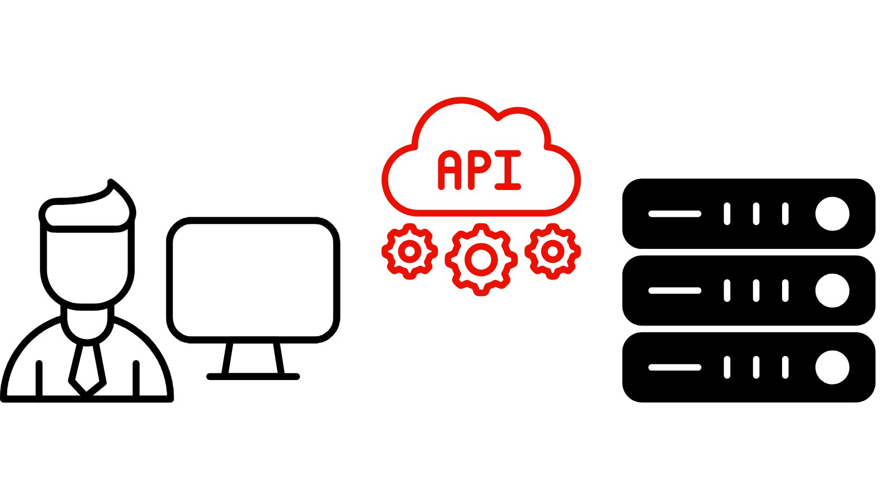

# 무생식 도구

<!-- last-modified: 2026-06-08 -->

모든 무의미한 도구들이 같은 요구를 제공하는 것은 아니다. 상황에 적합한 시작점을 선택할 수 있도록 각 사용자가 수행하는 작업, 사용 시기 및 시작 방법을 살펴봅니다.

<!--
CARDS

* mcp-servers.md
  {title = MCP Servers}
  {description = Connect any compatible AI client to Adobe CX Enterprise data and workflows. No coding required.}
  {cta = Explore MCP Servers}
  {image = ../assets/mcp-servers-card.png}

* agent-skills.md
  {title = Agent Skills}
  {description = Adobe-curated workflow instructions that guide agents through CX Enterprise tasks consistently.}
  {cta = Explore Agent Skills}
  {image = ../assets/agent-skills-card.png}

* apis.md
  {title = APIs for Builders}
  {description = Build custom applications and integrations using the same APIs that power Adobe products.}
  {cta = Explore APIs for Builders}
  {image = ../assets/apis-card.png}

-->
<!-- START CARDS HTML - DO NOT MODIFY BY HAND -->

    

        

            

                <figure class="image x-is-16by9">
                    
                </figure>
            

            

                

                    

                        <a href="mcp-servers.md" title="MCP 서버">MCP 서버</a>
                    

                    
호환되는 모든 AI 클라이언트를 Adobe CX 엔터프라이즈 데이터 및 워크플로우에 연결합니다. 코딩이 필요하지 않습니다.

                

                <a href="mcp-servers.md" class="spectrum-Button spectrum-Button--outline spectrum-Button--primary spectrum-Button--sizeM" style="align-self: flex-start; margin-top: 1rem;">
                    MCP 서버 탐색
                </a>
            

        

    

    

        

            

                <figure class="image x-is-16by9">
                    
                </figure>
            

            

                

                    

                        <a href="agent-skills.md" title="에이전트 스킬">에이전트 기술</a>
                    

                    
Adobe에서 제공하는 워크플로 지침은 에이전트에게 CX 엔터프라이즈 작업을 일관되게 안내합니다.

                

                <a href="agent-skills.md" class="spectrum-Button spectrum-Button--outline spectrum-Button--primary spectrum-Button--sizeM" style="align-self: flex-start; margin-top: 1rem;">
                    에이전트 기술 살펴보기
                </a>
            

        

    

    

        

            

                <figure class="image x-is-16by9">
                    
                </figure>
            

            

                

                    

                        빌더용 <a href="apis.md" title="빌더용 API">API</a>
                    

                    
Adobe 제품을 구동하는 동일한 API를 사용하여 사용자 정의 애플리케이션 및 통합을 구축할 수 있습니다.

                

                <a href="apis.md" class="spectrum-Button spectrum-Button--outline spectrum-Button--primary spectrum-Button--sizeM" style="align-self: flex-start; margin-top: 1rem;">
                    빌더를 위한 API 탐색
                </a>
            

        

    

<!-- END CARDS HTML - DO NOT MODIFY BY HAND -->

## 무생식 도구 비교

| | MCP 서버 | 에이전트 스킬 | 빌더용 API |
| --- | --- | --- | --- |
| 다음에 최적 | CX 엔터프라이즈 애플리케이션 사용자 | CX 엔터프라이즈 애플리케이션 사용자 및 개발자 | 개발자 |
| 코딩 필요 | 아니요 | 아니오 | 예 |
| 설정 시간 | 분 | 분 | 시간 ~ 일 |
| 받은 항목 | AI 클라이언트에서 CX 엔터프라이즈 애플리케이션에 액세스 | 가이드 및 반복 가능한 워크플로 | 전체 프로그램 제어 |

## 어디서부터 시작할지 모르겠습니까?

- AI를 사용하여 CX 엔터프라이즈 애플리케이션과 상호 작용하려면(작업을 수행하고, 데이터를 쿼리하고, AI가 자연스러운 대화를 통해 다음 작업을 찾도록 허용) [MCP 서버](mcp-servers.md)가 가장 유연한 시작점입니다.
- 에이전트가 CX Enterprise 워크플로우에 대한 Adobe 모범 사례를 즉흥 처리 없이 일관되게 따르도록 하려면 [에이전트 기술](agent-skills.md)에서 해당 도메인의 전문 지식을 재사용 가능한 지침으로 인코딩하십시오.
- 사용자를 위해 특정 CX 엔터프라이즈 워크플로우를 간소화하거나 자동화하는 집중 응용 프로그램을 빌드하려면 [빌더를 위한 API](apis.md)를 통해 발생하는 작업을 직접 프로그래밍 방식으로 제어할 수 있습니다.

>[!BEGINTABS]

>[!TAB MCP 서버]

MCP 서버를 AI 클라이언트와 CX 엔터프라이즈 애플리케이션 간의 라이브 와이어로 생각해 보십시오. 한 번 연결하면 AI가 캠페인을 쿼리하고, 대상을 가져오고, 여정 상태를 확인하는 등의 작업을 일반 언어로 수행할 수 있으며, 코드가 필요하지 않습니다.

**다음 경우에 MCP 서버 사용:**

- AI를 CX 엔터프라이즈 워크플로우에 직접 통합하려는 경우
- 이미 사용하고 있는 AI 클라이언트 내에 CX 엔터프라이즈 데이터를 원하는 경우
- 탐색적 분석 또는 임시 데이터 검색을 수행하는 경우
- 프로젝트를 회전하지 않고 결과를 빠르게 원하는 경우

[MCP 서버 탐색](mcp-servers.md)

>[!TAB 에이전트 기술]

에이전트 기술은 에이전트가 따를 수 있는 지침으로 인코딩된 Adobe의 도메인 전문 기술입니다. CX 엔터프라이즈 워크플로우에 맞게 조정되고 안정적이며 반복적으로 수행할 수 있는 작업을 정확하게 알려 주는 것이 바로 에이전트입니다.

**다음의 경우 에이전트 기술을 사용합니다.**

- AI 클라이언트를 통해 CX 엔터프라이즈 앱에서 작업을 수행할 때 Adobe 모범 사례를 따랐으면 합니다
- 매번 같은 방법으로 같은 작업을 수행해야 합니다.
- 반복 가능한 콘텐츠 또는 미디어 프로덕션 워크플로우를 실행 중입니다.

[에이전트 스킬 탐색](agent-skills.md)

>[!TAB 빌더용  API]

API는 기본 구성단위입니다. 개발자는 Adobe의 자체 제품을 구동하는 동일한 API를 사용하여 Adobe 데이터 및 작업에 직접 프로그래밍 방식으로 액세스할 수 있습니다. 이를 통해 조직에서 필요로 하는 가드레일을 통해 특정 비즈니스 워크플로를 간소화하는 집중화된 사용자 정의 경험을 구축할 수 있습니다.

**API 사용 시기:**

- 특정 비즈니스 사용 사례에 맞게 사용자 정의 애플리케이션 또는 통합을 구축하고 있습니다.
- 특정 보호 기능 및 제어 기능으로 워크플로우를 최적화 또는 자동화해야 합니다
- 클라우드 코드 또는 커서를 사용하여 전체 응용 프로그램을 생성하고 있습니다.
- CX 엔터프라이즈 데이터를 다른 시스템에 통합해야 함

[빌더를 위한 API 살펴보기](apis.md)

>[!ENDTABS]

## 함께 사용

이러한 도구는 함께 작동하도록 설계되었습니다. 이를 결합하면 Adobe AI에서 가장 많은 것을 얻을 수 있습니다. 에이전트 기술은 AI 클라이언트가 MCP 서버를 사용하여 CX 엔터프라이즈 워크플로우에 대한 올바른 경로를 에이전트를 유지하는 방법을 안내할 수 있습니다. 또한 스킬은 API를 호출하는 방법과 시기를 알려 주며, 사용자 지정 제작 자동화에 Adobe 모범 사례 가드레일을 추가할 수 있습니다. 하나만 고르실 필요는 없습니다

## 실행 중인 무생식 도구

실제 CX 엔터프라이즈 워크플로우에 적용되는 툴을 참조하십시오.

<!--
CARDS

* ../use-cases/query-audiences.md
  {title = Query audiences}
  {description = Use CX Enterprise MCP to query Real-Time CDP audience and destination data using plain language prompts.}
  {cta = Try with MCP}

* https://experienceleague.adobe.com/ko/docs/experience-manager-learn/cloud-service/ai/ai-assisted-development/use-cases/component-development
  {title = Develop AEM components with AI}
  {description = Use Claude Code or Cursor with Agent Skills to scaffold, code, and refine AEM components guided by Adobe best practices.}
  {cta = Try with Agent Skills}
  {image = ../assets/agent-skills-card.png}

* https://experienceleague.adobe.com/ko/docs/experience-manager-learn/cloud-service/aem-apis/openapis/invoke-api-using-oauth-web-app
  {title = Invoke AEM APIs from a web app}
  {description = Build a web application that authenticates users and calls AEM OpenAPIs using OAuth to deliver governed, programmatic access.}
  {cta = Try with APIs}
  {image = ../assets/using-api-card.png}

-->
<!-- START CARDS HTML - DO NOT MODIFY BY HAND -->

    

        

            

                <figure class="image x-is-16by9">
                    
                </figure>
            

            

                

                    

                        <a href="../use-cases/query-audiences.md" title="쿼리 대상자">대상자 쿼리</a>
                    

                    
CX 엔터프라이즈 MCP 를 사용하여 일반 언어 프롬프트를 사용하여 Real-Time CDP 대상 및 대상 데이터를 쿼리합니다.

                

                <a href="../use-cases/query-audiences.md" class="spectrum-Button spectrum-Button--outline spectrum-Button--primary spectrum-Button--sizeM" style="align-self: flex-start; margin-top: 1rem;">
                    MCP로 시도
                </a>
            

        

    

    

        

            

                <figure class="image x-is-16by9">
                    
                </figure>
            

            

                

                    

                        <a href="https://experienceleague.adobe.com/ko/docs/experience-manager-learn/cloud-service/ai/ai-assisted-development/use-cases/component-development" target="_blank" rel="referrer" title="AI를 사용하여 AEM 구성 요소 개발">AI를 사용하여 AEM 구성 요소 개발</a>
                    

                    
에이전트 기술과 함께 클라우드 코드 또는 커서를 사용하여 Adobe 모범 사례에 따라 AEM 구성 요소를 스캐폴드, 코드 및 세분화합니다.

                

                <a href="https://experienceleague.adobe.com/ko/docs/experience-manager-learn/cloud-service/ai/ai-assisted-development/use-cases/component-development" target="_blank" rel="referrer" class="spectrum-Button spectrum-Button--outline spectrum-Button--primary spectrum-Button--sizeM" style="align-self: flex-start; margin-top: 1rem;">
                    에이전트 기술을 사용해 보세요
                </a>
            

        

    

    

        

            

                <figure class="image x-is-16by9">
                    
                </figure>
            

            

                

                    

                        <a href="https://experienceleague.adobe.com/ko/docs/experience-manager-learn/cloud-service/aem-apis/openapis/invoke-api-using-oauth-web-app" target="_blank" rel="referrer" title="웹 앱에서 AEM API 호출">웹 앱에서 AEM API 호출</a>
                    

                    
사용자를 인증하고 OAuth를 사용하여 AEM OpenAPI를 호출하여 관리되는 프로그래밍 방식 액세스를 제공하는 웹 애플리케이션을 빌드합니다.

                

                <a href="https://experienceleague.adobe.com/ko/docs/experience-manager-learn/cloud-service/aem-apis/openapis/invoke-api-using-oauth-web-app" target="_blank" rel="referrer" class="spectrum-Button spectrum-Button--outline spectrum-Button--primary spectrum-Button--sizeM" style="align-self: flex-start; margin-top: 1rem;">
                    API로 시도
                </a>
            

        

    

<!-- END CARDS HTML - DO NOT MODIFY BY HAND -->
