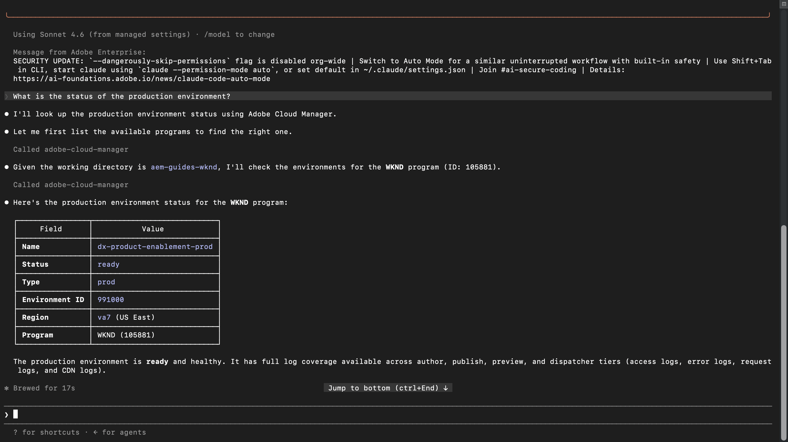
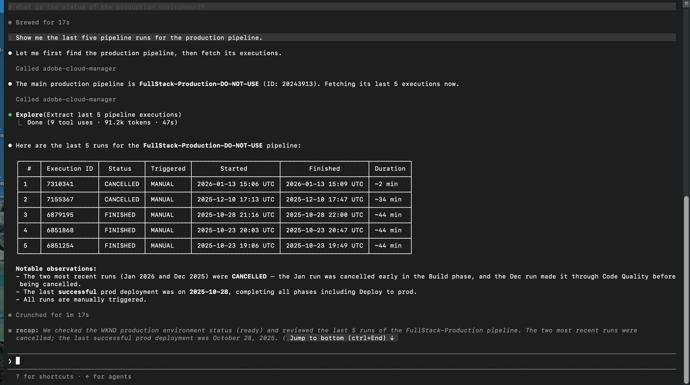
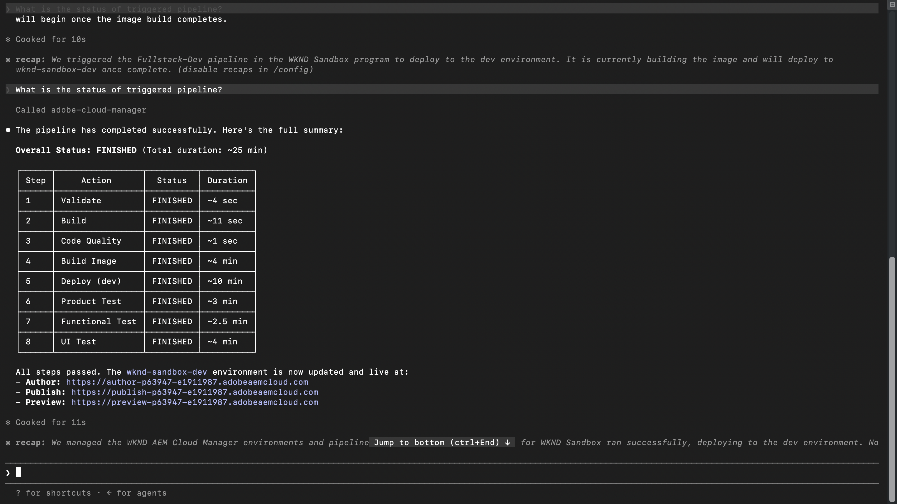

# 안심하고 AEM as a Cloud Service에 배포

<!-- last-modified: 2026-05-21 -->

>[!VIDEO](https://video.tv.adobe.com/v/3480349/?captions=kor&learn=on&enablevpops)

Adobe Experience Manager 환경 관리는 일반적으로 Cloud Manager에 로그인하고, 파이프라인 및 환경을 탐색하고, 컨텍스트를 전환하여 배포 상태를 추적하는 것을 의미합니다. 이 연습에서는 개발자와 작업 팀이 AI 환경을 종료하지 않고 상태를 확인하고, 파이프라인을 검토하고, 배포 세부 사항에 대해 작업할 수 있도록 AEM Cloud Manager MCP 서버를 사용하여 AI 클라이언트에서 작업을 처리하는 방법을 보여 줍니다.

| | |
| --- | --- |
| CX 엔터프라이즈 애플리케이션 | Adobe Experience Manager Cloud Manager |
| 무생식 도구 | AEM Cloud Manager 서버 |
| 대상자 | 개발자, DevOps, 운영 팀 |
| 사전 요구 사항 | MCP 호환 AI 클라이언트, AEM Cloud Manager 액세스 |

각 단계에는 하나의 대표적인 프롬프트와 예제 AI 응답이 표시됩니다. 같은 세션에서 추가 탐색을 위해 **다시 시도하라는 메시지** 섹션이 표시됩니다.

## 시작하기에 앞서

>[!BEGINTABS]

>[!TAB 클라우드 코드]

먼저 프로젝트 디렉토리로 이동한 다음 CLI를 사용하여 Cloud Manager MCP 서버를 추가합니다.

```bash
claude mcp add --transport http adobe-cloud-manager https://mcp.adobeaemcloud.com/adobe/mcp/cloudmanager
```

또는 프로젝트 루트의 `.mcp.json`에 수동으로 추가하십시오.

```json
{
  "mcpServers": {
    "adobe-cloud-manager": {
      "type": "http",
      "url": "https://mcp.adobeaemcloud.com/adobe/mcp/cloudmanager"
    }
  }
}
```

클라우드 코드를 다시 시작합니다. Cloud Manager 도구는 다음 세션에서 사용할 수 있습니다.

전체 설정: [코드 MCP 설명서 빌드](https://docs.anthropic.com/en/docs/claude-code/mcp)

>[!TAB 커서]

프로젝트 루트의 `~/.cursor/mcp.json`(전역) 또는 `.cursor/mcp.json`에 Cloud Manager MCP 서버 추가:

```json
{
  "mcpServers": {
    "adobe-cloud-manager": {
      "type": "http",
      "url": "https://mcp.adobeaemcloud.com/adobe/mcp/cloudmanager"
    }
  }
}
```

**설정 > MCP**&#x200B;를 열고 서버 옆에 있는 **연결**&#x200B;을 선택하고 Adobe ID으로 로그인합니다.

전체 설정: [커서 MCP 설명서](https://cursor.com/docs/mcp)

>[!TAB GitHub Copilot]

프로젝트 루트의 `.vscode/mcp.json`에 Cloud Manager MCP 서버 추가:

```json
{
  "servers": {
    "adobe-cloud-manager": {
      "type": "http",
      "url": "https://mcp.adobeaemcloud.com/adobe/mcp/cloudmanager"
    }
  }
}
```

참고: VS 코드에서는 `"mcpServers"`이(가) 아닌 `"servers"`을(를) 최상위 키로 사용합니다.

**GitHub Copilot 채팅** 패널을 열고 **에이전트 모드**(으)로 전환한 다음 서버 옆에서 **연결**&#x200B;을(를) 선택합니다. MCP 도구는 에이전트 모드에서만 사용할 수 있습니다.

전체 설정: [VS 코드 MCP 서버 설명서](https://code.visualstudio.com/docs/copilot/customization/mcp-servers)

>[!TAB 기타 AI 클라이언트]

다른 MCP 호환 환경을 사용하고 있습니까? 다음 끝점을 사용하여 Cloud Manager MCP 서버에 연결합니다.

```
https://mcp.adobeaemcloud.com/adobe/mcp/cloudmanager
```

지원되는 모든 클라이언트에 대한 전체 설치 지침: [AI 클라이언트에 연결](../tools/mcp-servers.md)

>[!ENDTABS]

>[!NOTE]
>
>메시지가 표시되면 Adobe ID으로 로그인하고 AEM as a Cloud Service 프로그램에 연결된 IMS 조직을 선택합니다. 권한은 Cloud Manager 수준에서 적용되며, AI 클라이언트는 계정에 권한이 부여된 작업만 수행할 수 있습니다.
>
>첫 번째 연결 시 AI 클라이언트가 조직 또는 AEM 프로그램을 확인하도록 요청할 수 있습니다. 컨텍스트가 설정되면 MCP 서버는 세션의 나머지 부분에 컨텍스트를 사용합니다.
>
>일부 도구는 실행 전에 승인을 묻는 메시지를 표시합니다. 제안된 작업을 검토하고 승인 또는 거부합니다. 확인 없이는 아무 작업도 수행되지 않습니다.

## 1단계: 환경 상태 확인

릴리스를 시작하기 전에 환경이 건강하고 현재 실행 중인 환경이 없는지 확인하십시오.

```
What is the status of the production environment?
```

+++예제 응답 보기



+++

## 2단계: 파이프라인 실행 검토

최신 파이프라인 내역을 검토하여 다음 릴리스를 차단하기 전에 배포 패턴을 이해하고 오류를 포착합니다.

```
Show me the last five pipeline runs for the production pipeline.
```

+++예제 응답 보기



+++

## 3단계: 파이프라인 트리거

AI 클라이언트에서 직접 파이프라인 실행을 시작합니다. 서버는 타겟 환경을 확인하고 시작하기 전에 승인을 요청합니다.

```
Run the Fullstack pipeline against dev environment of WKND sandbox program.
```

+++예제 응답 보기


+++

>[!CAUTION]
>
>AI 클라이언트는 실행을 트리거하기 전에 파이프라인 이름을 확인하라는 메시지를 표시합니다. 진행할 정확한 파이프라인 이름을 입력합니다. 특히 프로덕션에 배포되는 파이프라인의 경우 확인하기 전에 타겟 환경을 주의 깊게 검토하십시오.

## 4단계: 파이프라인 상태 확인

실행을 트리거한 후 Cloud Manager 인터페이스로 전환하지 않고 AI 클라이언트에 상태 업데이트를 요청합니다.

```
What is the status of the triggered pipeline?
```

+++예제 응답 보기



+++

## 수행한 작업

AEM Cloud Manager MCP 서버를 사용하여 Cloud Manager 인터페이스를 열지 않고도 환경 상태를 확인하고, 파이프라인 내역을 검토하고, 배포를 트리거하고, 상태를 확인할 수 있습니다. 개발 및 운영 팀은 단일 AI 세션에서 환경 가시성과 배포 제어를 결합함으로써 문제에 보다 신속하게 대응하고 이미 사용 중인 도구 내에서 워크플로를 유지할 수 있습니다.

## 수행할 수 있는 작업 더 보기

Cloud Manager MCP 서버는 위의 연습에서 다루는 것보다 훨씬 더 많은 작업을 처리합니다. 동일한 세션에서 시도할 수 있는 프롬프트를 보려면 아래 시나리오를 확장하십시오.

+++릴리스가 종료되기 전에 문제 발생

파이프라인이 실행되기 전에 표시되는 이유로 배포가 실패하는 경우가 많습니다. 이러한 프롬프트는 릴리스를 커밋하기 전에 환경 상태를 확인하고, 충돌하는 실행을 확인하고, 환경 간에 버전 정렬을 확인하는 데 도움이 됩니다.

**프롬프트**

```
We're about to kick off a production release. Give me a full status check on all environments first.
```

```
Is there anything currently running in the staging pipeline? I don't want to queue on top of an active run.
```

```
Before I promote main branch to production, confirm main was deployed to Dev and all environments are on the same AEM version.
```

```
What repositories are connected to the WKND program?
```

+++

+++이미 실행 중인 배포 과정 수정

우발적 트리거 또는 정지된 승인 게이트는 차단된 파이프라인 또는 원치 않는 배포로 캐스케이드될 수 있습니다. 이러한 프롬프트를 통해 Cloud Manager 인터페이스로 전환하지 않고 실행 중인 파이프라인을 취소하거나 진행할 수 있습니다.

**프롬프트**

```
The staging pipeline kicked off by mistake. Cancel it before it deploys.
```

```
The release pipeline is waiting at the approval gate. Advance it to continue the deployment.
```

+++

+++배포 추적 레코드 이해

상황이 마지막으로 성공한 시기, 파이프라인이 실행되는 기간 및 패턴이 변경되고 있는지 아는 것은 릴리스를 계획하고 문제가 되기 전에 느린 저하를 포착하는 데 도움이 됩니다. 이 프롬프트를 사용하여 요청 시 해당 내역을 가져옵니다.

**프롬프트**

```
What is the status of the last production pipeline execution? If it failed, explain why.
```

```
When was the last successful deployment to the staging environment?
```

```
Our pipeline times are creeping up. What's the longest run we've had in the last 30 days?
```

+++

+++손상된 빌드를 다시 정상적으로 가져오기

파이프라인이 실패하면 가장 빠른 해결 방법은 정확히 어디에서 중단되었으며 그 이유를 이해하는 것입니다. 이러한 메시지는 표면 장애 세부 정보, 변경 내역 및 품질 게이트 문제를 표시하므로 팀에서 로그를 수동으로 검색하지 않고도 진단하고 수정할 수 있습니다.

**프롬프트**

```
We're seeing a regression on the live site. What changed in production over the last week?
```

```
Which pipelines have failed in the last 7 days, and at what stage did they fail?
```

```
The last pipeline failed at the code quality step. What specific issues need to be fixed before I can retry?
```

```
Pull the step logs for the last failed run. I need to see exactly what the quality gate flagged.
```

+++

## 추가 정보

| 리소스 | 찾을 내용 |
| --- | --- |
| [AEM Cloud Manager 설명서](https://experienceleague.adobe.com/en/docs/experience-manager-cloud-service/content/implementing/using-cloud-manager/introduction-to-cloud-manager) | 전체 Cloud Manager 애플리케이션 설명서 |
| [AEM as a Cloud Service 설명서](https://experienceleague.adobe.com/ko/docs/experience-manager-cloud-service) | 전체 AEM 애플리케이션 설명서 |
| [MCP 서버](../tools/mcp-servers.md) | AI 클라이언트를 Adobe MCP 서버에 연결 |
