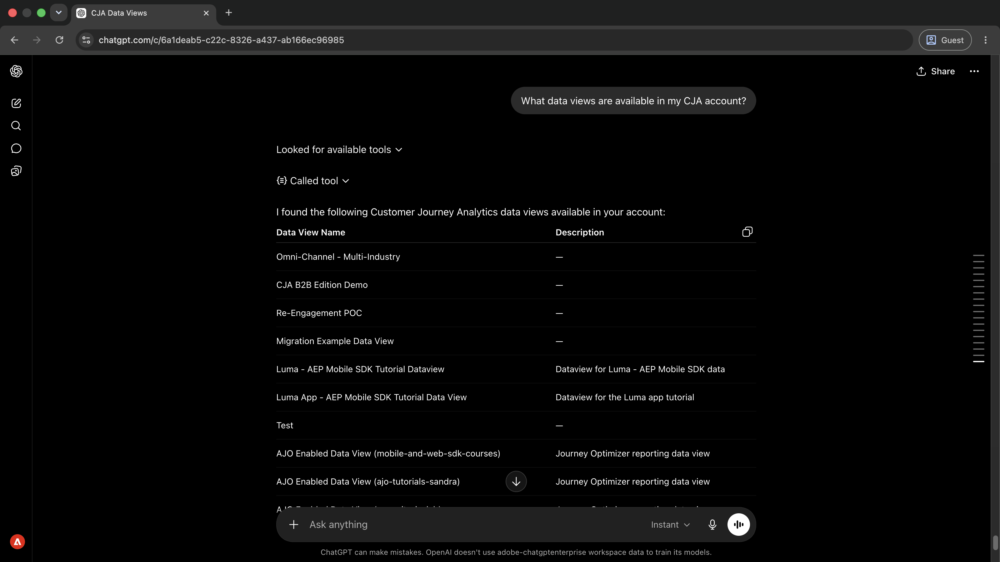
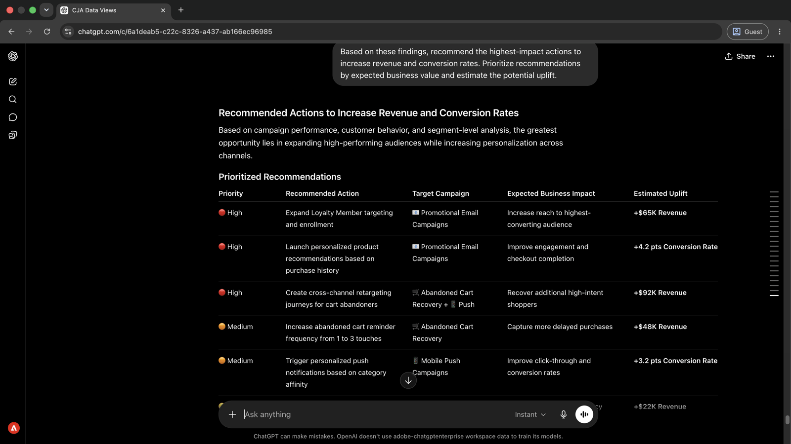

# 보고서를 작성하지 않고 캠페인 통찰력 표시

<!-- last-modified: 2026-06-02 -->

{zoomable="yes"}

*확대/축소를 선택합니다.*

한 때 별도의 도구로 보고서를 작성해야 했던 캠페인 분석이 이제 대화로 바뀌었습니다. 이 연습에서는 AI 클라이언트를 Customer Journey Analytics(CJA)에 연결하고 일반 언어로 성능 질문을 하는 방법을 보여 줍니다. 따라서 수동으로 보고서를 작성할 필요 없이 insight으로 이동하는 시간이 단축됩니다.

| 시나리오 세부 정보 | |
| --- | --- |
| CX 엔터프라이즈 애플리케이션 | [Customer Journey Analytics(CJA)](https://experienceleague.adobe.com/ko/docs/analytics-platform/using/cja-overview/cja-overview) |
| 무생식 도구 | [CX 동료 게이트웨이](../tools/mcp-servers.md#cx-coworker-gateway) |
| 대상자 | 분석가, 캠페인 관리자 |
| 사전 요구 사항 | MCP 호환 AI 클라이언트, CJA 액세스 |

각 단계에는 하나의 대표적인 프롬프트와 예제 AI 응답이 표시됩니다. 같은 세션에서 추가 탐색을 위해 **수행할 수 있는 추가** 섹션이 다음과 같습니다.

## 시작하기에 앞서

>[!BEGINTABS]

>[!TAB 클라우드.ai]

CX Coworker Gateway를 사용자 정의 커넥터로 연결하여 Customer Journey Analytics 도구에 액세스합니다.

1. Cloud.ai의 **설정 > 통합**(으)로 이동합니다.
2. **사용자 지정 커넥터 추가**&#x200B;를 선택하고 서버 URL을 입력하십시오. `https://cx-coworker-gateway.adobe.io/mcp`
3. **연결**&#x200B;을 선택하고 Adobe ID으로 로그인하세요.

전체 설정: [Claude.ai 사용자 지정 커넥터 설명서](https://support.claude.com/en/articles/11175166-get-started-with-custom-connectors-using-remote-mcp)

>[!TAB ChatGPT]

ChatGPT 개발자 모드(Pro, Plus, 비즈니스, 엔터프라이즈 또는 교육 계획 필요)를 사용하여 CX Coworker Gateway를 연결합니다.

1. **ChatGPT 설정**&#x200B;에서 **개발자 모드**&#x200B;를 사용하도록 설정합니다.
2. **설정 > 통합**(으)로 이동하여 **사용자 지정 커넥터 추가 > 원격 MCP 서버**&#x200B;를 선택합니다.
3. 서버 URL 입력: `https://cx-coworker-gateway.adobe.io/mcp`
4. **연결**&#x200B;을 선택하고 Adobe ID으로 로그인하세요.

전체 설정: [ChatGPT MCP 설명서](https://developers.openai.com/api/docs/guides/tools-connectors-mcp)

>[!TAB 기타 AI 클라이언트]

Gemini, Microsoft Copilot, Cursor, Claude Code 또는 다른 MCP 호환 환경을 사용하시겠습니까? 다음 끝점을 사용하여 CX Coworker Gateway에 연결합니다.

```
https://cx-coworker-gateway.adobe.io/mcp
```

지원되는 모든 클라이언트에 대한 전체 설치 지침: [AI 클라이언트에 연결](../tools/mcp-servers.md)

>[!ENDTABS]

>[!NOTE]
>
>메시지가 표시되면 Adobe ID으로 로그인하고 CJA 데이터 보기에 연결된 IMS 조직을 선택합니다. 잘못된 조직을 선택하는 것이 인증 오류의 가장 일반적인 원인입니다.
>
>첫 번째 연결 시 AI 클라이언트가 IMS 조직을 선택하거나 샌드박스를 지정하도록 요청할 수 있습니다. 컨텍스트가 설정되면 MCP 서버는 세션의 나머지 부분에 컨텍스트를 사용합니다.
>
>일부 도구는 실행 전에 승인을 묻는 메시지를 표시합니다. 요청을 검토하고 승인 또는 거절합니다. 확인 없이는 아무 작업도 수행되지 않습니다.

## 1단계: 사용 가능한 데이터 보기 검색

먼저 AI 클라이언트에 CJA 계정에서 사용할 수 있는 데이터 보기를 나열하도록 요청합니다. 보고서를 실행하기 전에 쿼리할 수 있는 데이터 세트를 알려줍니다.

```
What data views are available in my CJA account?
```

+++예제 응답 보기

{zoomable="yes"}

*확대/축소를 선택합니다.*

+++


## 2단계: 캠페인 성과 데이터 가져오기

식별된 데이터 보기에서 매출 및 전환율별로 캠페인 성과를 요청합니다. AI는 기술 ID 없이 데이터 보기에서 지표 및 차원 이름을 확인합니다.

```
For '[data view name]', show me the top campaigns by revenue and conversion rate for the last 30 days.
```

+++예제 응답 보기

{zoomable="yes"}

*확대/축소를 선택합니다.*

+++


>[!NOTE]
>
>`[data view name]`을(를) 1단계의 데이터 보기 이름으로 바꾸십시오. 이해 당사자와 공유하기 전에 동일한 데이터 보기와 날짜 범위를 사용하여 Analysis Workspace에서 결과를 상호 확인합니다.

## 3단계: 성능을 유도하는 요소 식별

AI 클라이언트에게 문의하여 캠페인 그룹 간 성능 차이를 유도하는 것이 무엇인지 설명하십시오. 이는 제목 수에서 아래의 변수로 이동합니다.

```
What factors are driving the results for these campaign groups?
```

+++예제 응답 보기

{zoomable="yes"}

*확대/축소를 선택합니다.*

+++


## 4단계: 특정 캠페인 유형 드릴아웃

세그먼트 수준 분류를 요청하여 특정 검색 결과에 대한 후속 작업을 수행합니다. 이렇게 하면 캠페인 유형 내에서 성과를 유도하는 고객 유형이 표시됩니다.

```
Break down Promotional Email Campaigns by Customer Segment and explain what's driving the high conversion rate.
```

+++예제 응답 보기

{zoomable="yes"}

*확대/축소를 선택합니다.*

+++


## 5단계: 찾은 항목 실행

세션에서 표시된 모든 사항을 기반으로 우선 순위가 지정된 권장 사항을 요청합니다. 비즈니스 가치 평가를 요청하면 가장 먼저 행동할 위치를 결정하는 데 도움이 됩니다.

```
Based on these findings, recommend the highest-impact actions to increase revenue and conversion rates. Prioritize recommendations by expected business value and estimate the potential uplift.
```

+++예제 응답 보기

{zoomable="yes"}

*확대/축소를 선택합니다.*

+++


>[!NOTE]
>
>CX Coworker Gateway를 통해 액세스되는 CJA 도구는 동일한 세션에서 CJA 내에 세그먼트, 계산된 지표 및 Workspace 프로젝트를 만들 수 있습니다. 다른 애플리케이션에서 캠페인, 여정 또는 콘텐츠를 업데이트하려면 관련 MCP 서버를 연결하거나 애플리케이션으로 직접 이동합니다.

## 수행한 작업

AI 클라이언트를 Customer Journey Analytics에 연결하고 5개의 프롬프트에서 데이터 보기 검색에서 우선 순위가 지정된 비즈니스 권장 사항으로 이동했습니다. 매출 및 전환율별로 최상위 캠페인을 식별하고, 캠페인 그룹 간에 성과를 이끄는 요인을 노출하고, 특정 캠페인 유형에 대한 세그먼트 수준 세부 정보를 드릴링하고, 예상 향상도와 함께 등급 권장 사항을 수신했습니다. 이 접근 방식은 보고서 작성을 직접적인 대화로 대체하므로 비즈니스 질문과 데이터 기반 작업 계획 간의 시간을 줄일 수 있습니다.

## 수행할 수 있는 작업 더 보기

CX Coworker Gateway는 연습 범위보다 훨씬 더 많은 Customer Journey Analytics 통찰력을 제공할 수 있습니다. 동일한 세션에서 시도할 수 있는 프롬프트를 보려면 아래 시나리오를 확장하십시오.

+++작동 중인 항목과 작동 중이 아닌 항목 찾기

전달되는 캠페인에 대한 간략한 그림으로, 세부 보고서를 검토하기 전에 노력을 집중하는 데 도움이 되지 않습니다. 이러한 프롬프트는 한 세션에서 해당 그림을 제공합니다.

**프롬프트**

```
Which campaigns are driving the most revenue and conversions?
```

```
Show me the campaigns that need attention this month.
```

```
What channels are outperforming expectations?
```

```
Identify the biggest performance changes compared to last month.
```

```
Show me conversion performance by traffic source.
```

+++

+++결과를 유도하는 것이 무엇인지 이해합니다.

헤드라인 지표는 발생한 상황을 알려줍니다. 이러한 프롬프트는 어떤 세그먼트, 채널 및 터치포인트가 숫자의 뒤에 있는지 이해하는 데 도움이 됩니다.

**프롬프트**

```
What factors are driving revenue growth?
```

```
Explain why conversion rates changed this quarter.
```

```
Break down campaign performance by customer segment.
```

```
Which customer segments are growing fastest?
```

```
Which touchpoints contribute most to conversions?
```

+++

+++성장 기회 발견

경기력이 강한 곳을 아는 것은 그림의 반일 뿐이다. 이러한 프롬프트는 더 많이 투자할 수 있는 위치, 여유 공간이 있는 대상, 확장할 준비가 된 캠페인을 식별하는 데 도움이 됩니다.

**프롬프트**

```
Where should we invest more marketing budget?
```

```
Which audiences have the greatest growth potential?
```

```
Which campaigns should we scale?
```

```
What would have the biggest impact on revenue?
```

+++

+++인사이트를 작업으로 전환

CX Coworker Gateway를 통해 액세스되는 CJA 도구는 AI 세션을 종료하지 않고 CJA에서 직접 세그먼트, 대상, 계산된 지표 및 Workspace 프로젝트를 만들 수 있습니다. 이러한 프롬프트를 사용하여 찾은 내용에 대해 조치를 취하십시오.

**프롬프트**

```
Create a segment for high-value customers.
```

```
Build an audience from recent purchasers.
```

```
Create a calculated metric for conversion efficiency.
```

```
Save this analysis as a Workspace project for executive reporting.
```

+++


## 추가 정보

| 리소스 | 찾을 내용 |
| --- | --- |
| [AI 레지스트리의 CJA MCP 서버](https://developer.adobe.com/ai-registry/#/mcp/cja-mcp){target="_blank"} | CJA MCP 서버 도구 및 가용성 |
| [Customer Journey Analytics 설명서](https://experienceleague.adobe.com/ko/docs/analytics-platform/using/cja-landing){target="_blank"} | 전체 CJA 애플리케이션 설명서 |
