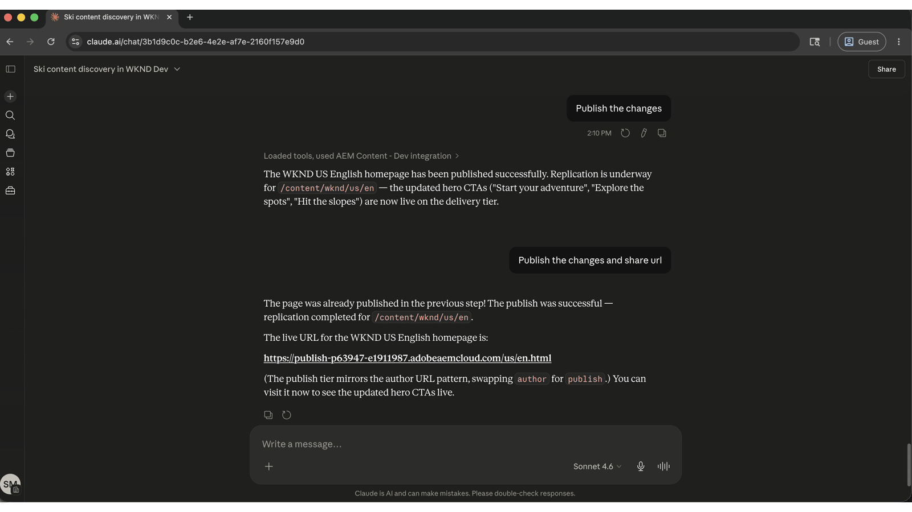

# 최신 컨텐츠 유지 및 업데이트 전달 속도 향상

<!-- last-modified: 2026-05-22 -->


페이지 찾기, 컨텐츠 검토에서 업데이트 및 게시에 이르기까지 Adobe Experience Manager에서 컨텐츠 작업을 수행하려면 일반적으로 AEM 인터페이스를 직접 탐색해야 합니다. 이 연습에서는 AEM Content MCP Server를 사용하여 AI 클라이언트를 통해 이러한 작업을 처리하는 방법을 보여 주므로, 도구 간에 컨텍스트 전환 없이 콘텐츠 팀이 더 빠르게 이동할 수 있습니다.

| | |
| --- | --- |
| CX 엔터프라이즈 애플리케이션 | Adobe Experience Manager as a Cloud Service |
| 무생식 도구 | AEM Content MCP 서버 |
| 대상자 | 콘텐츠 관리자, 마케팅 팀 |
| 사전 요구 사항 | MCP 호환 AI 클라이언트, AEM as a Cloud Service 액세스 |

각 단계에는 하나의 대표적인 프롬프트와 예제 AI 응답이 표시됩니다. 같은 세션에서 추가 탐색을 위해 **수행할 수 있는 추가** 섹션이 다음과 같습니다.

## 시작하기에 앞서

>[!BEGINTABS]

>[!TAB 클라우드.ai]

AEM Content MCP Server를 사용자 지정 커넥터로 연결합니다.

1. Cloud.ai의 **설정 > 통합**(으)로 이동합니다.
2. **사용자 지정 커넥터 추가**&#x200B;를 선택하고 서버 URL을 입력하십시오. `https://mcp.adobeaemcloud.com/adobe/mcp/content`
3. **연결**&#x200B;을 선택하고 Adobe ID으로 로그인하세요.

전체 설정: [Claude.ai 사용자 지정 커넥터 설명서](https://support.claude.com/en/articles/11175166-get-started-with-custom-connectors-using-remote-mcp)

>[!TAB ChatGPT]

ChatGPT 개발자 모드(Pro, Plus, 비즈니스, 엔터프라이즈 또는 교육 계획 필요)를 사용하여 AEM Content MCP 서버를 연결합니다.

1. **ChatGPT 설정**&#x200B;에서 **개발자 모드**&#x200B;를 사용하도록 설정합니다.
2. **설정 > 통합**(으)로 이동하여 **사용자 지정 커넥터 추가 > 원격 MCP 서버**&#x200B;를 선택합니다.
3. 서버 URL 입력: `https://mcp.adobeaemcloud.com/adobe/mcp/content`
4. **연결**&#x200B;을 선택하고 Adobe ID으로 로그인하세요.

전체 설정: [ChatGPT MCP 설명서](https://developers.openai.com/api/docs/guides/tools-connectors-mcp)

>[!TAB 기타 AI 클라이언트]

Gemini, Microsoft Copilot, Cursor, Claude Code 또는 다른 MCP 호환 환경을 사용하시겠습니까? 다음 끝점을 사용하여 AEM Content MCP 서버에 연결합니다.

```
https://mcp.adobeaemcloud.com/adobe/mcp/content
```

지원되는 모든 클라이언트에 대한 전체 설치 지침: [AI 클라이언트에 연결](../tools/mcp-servers.md)

>[!ENDTABS]

>[!NOTE]
>
>메시지가 표시되면 Adobe ID으로 로그인하고 AEM as a Cloud Service 환경에 연결된 IMS 조직을 선택합니다. 권한은 AEM 수준에서 적용됩니다. AI 클라이언트는 계정이 승인된 작업만 수행할 수 있습니다.
>
>변경하지 않고 컨텐츠를 검색하거나 감사하기만 하면 되는 경우 대신 읽기 전용 서버 엔드포인트 `https://mcp.adobeaemcloud.com/adobe/mcp/content-readonly`을(를) 사용하십시오. 이 페이지의 모든 검색 및 검토 프롬프트는 두 서버 모두에서 작동합니다.
>
>첫 번째 연결 시 AI 클라이언트가 조직 또는 AEM 환경을 확인하도록 요청할 수 있습니다. 컨텍스트가 설정되면 MCP 서버는 세션의 나머지 부분에 컨텍스트를 사용합니다.
>
>일부 도구는 실행 전에 승인을 묻는 메시지를 표시합니다. 제안된 작업을 검토하고 승인 또는 거부합니다. 확인 없이는 변경 사항이 적용되지 않습니다.

## 1단계: AEM 환경에서 컨텐츠 찾기

먼저 AI 클라이언트에게 AEM 환경을 검색하고 콘텐츠를 검색하도록 요청합니다. 정확한 경로를 알지 못하면서 주제, 키워드 또는 콘텐츠 유형별로 검색할 수 있다.

```
From WKND Dev environment, find all ski related content.
```

+++예제 응답 보기


+++


## 2단계: 특정 페이지 검토

관련 콘텐츠를 찾은 후에는 AI 클라이언트에게 특정 페이지를 보여달라고 요청합니다. 이름이나 경로로 페이지를 참조할 수 있습니다. MCP 서버가 참조를 확인하고 콘텐츠 구조를 반환합니다.

```
Show me the US English Home Page.
```

+++예제 응답 보기


+++


## 3단계: 콘텐츠 개선

페이지 콘텐츠를 볼 때 AI 클라이언트에게 개선 사항을 제안하거나 적용하도록 요청합니다. AI는 현재 페이지가 말하는 내용에 근거한 복사 변경 사항을 제안하고 아무것도 작성하기 전에 확인을 요청할 수 있습니다.

```
Improve the Hero CTAs.
```

+++예제 응답 보기


+++


>[!CAUTION]
>
>메시지가 표시되면 각 변경 사항을 확인합니다. AEM Content MCP Server는 콘텐츠를 작성, 업데이트 및 삭제할 수 있습니다. 특히 라이브 페이지에서 승인하기 전에 제안된 변경 사항을 검토하십시오.

## 4단계: 게시 및 공유

업데이트를 확인한 후 페이지를 게시하고 공유 가능한 URL을 검색하십시오. 모두 동일한 대화에서 수행됩니다.

```
Publish the changes and share the URL.
```

+++예제 응답 보기



+++


## 수행한 작업

AEM Content MCP Server를 사용하여 AEM 인터페이스를 열지 않고도 콘텐츠를 찾고, 라이브 페이지를 검토하고, AI가 제안한 개선 사항을 적용하고, 결과를 게시했습니다. 콘텐츠 팀은 단일 AI 세션에서 콘텐츠 검색, 편집 및 게시를 결합함으로써 차이를 식별하던 방식에서 더 적은 수의 컨텍스트 스위치로 업데이트를 더 빨리 전달할 수 있습니다. 동일한 워크플로우가 여러 페이지, 콘텐츠 조각 및 조정된 캠페인 시작으로 확장됩니다.

## 수행할 수 있는 작업 더 보기

AEM Content MCP Server는 연습 과정에서 다루는 것 이상의 기능을 수행합니다. 동일한 세션에서 시도할 수 있는 프롬프트를 보려면 아래 시나리오를 확장하십시오.

+++사이트 검토 또는 재시작 진행

콘텐츠 감사는 수동으로 수행하는 경우 시간이 오래 걸립니다. 이러한 프롬프트는 오래된 콘텐츠, 배송되지 않은 초안, 주요 푸시 전에 수정해야 하는 간격을 빠르게 표면화하는 데 도움이 됩니다.

**프롬프트**

```
Show me everything updated in the last two weeks.
```

```
What content is sitting in draft and hasn't been published yet?
```

```
Find pages that haven't been touched in over a year.
```

```
Which pages are missing their description field?
```

```
We're reorganizing the taxonomy. Find all articles missing tags or categories.
```

+++

+++규모에 맞게 SEO 및 접근성 문제 해결

SEO 및 접근성 격차는 큰 사이트 전체에 걸쳐 빠르게 혼합됩니다. 이러한 메시지는 감사 또는 실행 전에 가장 중요한 문제를 찾고 우선 순위를 지정하는 데 도움이 됩니다.

**프롬프트**

```
Pull a list of all pages with an empty meta description.
```

```
Which pages have thin content that's likely to underperform for SEO?
```

```
Find all images missing alt text.
```

```
Our CTAs aren't consistent. Scan the site and flag anywhere the call-to-action wording differs from "Book now."
```

```
The homepage was updated yesterday. Show me what changed compared to the version before.
```

+++

+++자산 라이브러리를 정리하고 준비하십시오.

자산 참조가 손상되고 업로드가 처리되지 않으면 콘텐츠 제작 속도가 느려집니다. 이러한 프롬프트는 페이지 업데이트나 캠페인을 차단하기 전에 자산을 찾고 관리하는 데 도움이 됩니다.

**프롬프트**

```
We're building a biking content series. What image assets do we already have?
```

```
Can you upload a placeholder asset from https://placehold.co/800x450/png to the wknd folder and save it as placeholder.png?
```

```
That asset was just uploaded. Is it processed and ready to use in a page?
```

```
I need to replace the hero image across the site. Which fragments are currently using it?
```

+++

+++여러 페이지에서 컨텐츠 실행 조정

캠페인을 시작한다는 것은 종종 여러 콘텐츠 조각 및 페이지 간의 변경 사항을 조정하는 것을 의미합니다. 이러한 프롬프트는 업데이트를 그룹화하고, 승격 전에 검토하고, 깔끔하게 배송하는 데 도움이 됩니다.

**프롬프트**

```
I need to update the surfing adventure. Show me its content and all its fields.
```

```
Create an EMEA market variation of the ski adventure fragment.
```

```
Bundle everything we changed in this session into a launch called May Updates.
```

```
What launches are open right now, and which ones are ready to promote?
```

```
Before I promote, show me exactly what changed between May Updates and what is currently live.
```

```
Promote the May Updates launch to production.
```

+++


## 추가 정보

| 리소스 | 찾을 내용 |
| --- | --- |
| [AEM Content MCP 서버 설명서](https://experienceleague.adobe.com/ko/docs/experience-manager-cloud-service/content/ai-in-aem/using-mcp-with-aem-as-a-cloud-service) | MCP 서버 설치 및 사용 안내서 |
| [AI 레지스트리의 AEM Content MCP 서버](https://developer.adobe.com/ai-registry/#/mcp/aem-content-mcp) | 도구 목록 및 가용성 |
| [AEM as a Cloud Service 설명서](https://experienceleague.adobe.com/ko/docs/experience-manager-cloud-service) | 전체 AEM 애플리케이션 설명서 |
| [AEM 콘텐츠 조각](https://experienceleague.adobe.com/ko/docs/experience-manager-cloud-service/content/assets/content-fragments/content-fragments) | 콘텐츠 조각 작성 참조 |
| [MCP 서버](../tools/mcp-servers.md) | AI 클라이언트를 Adobe MCP 서버에 연결 |
